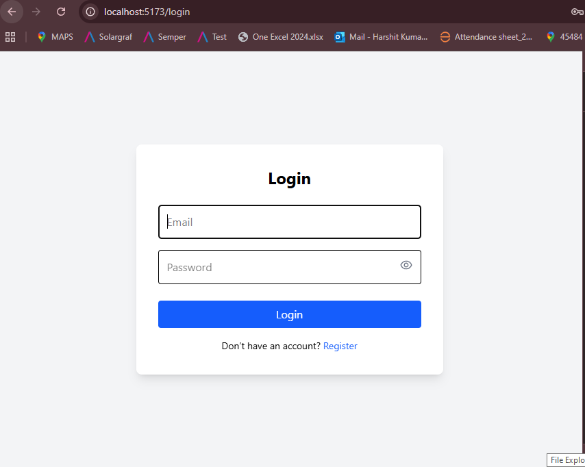
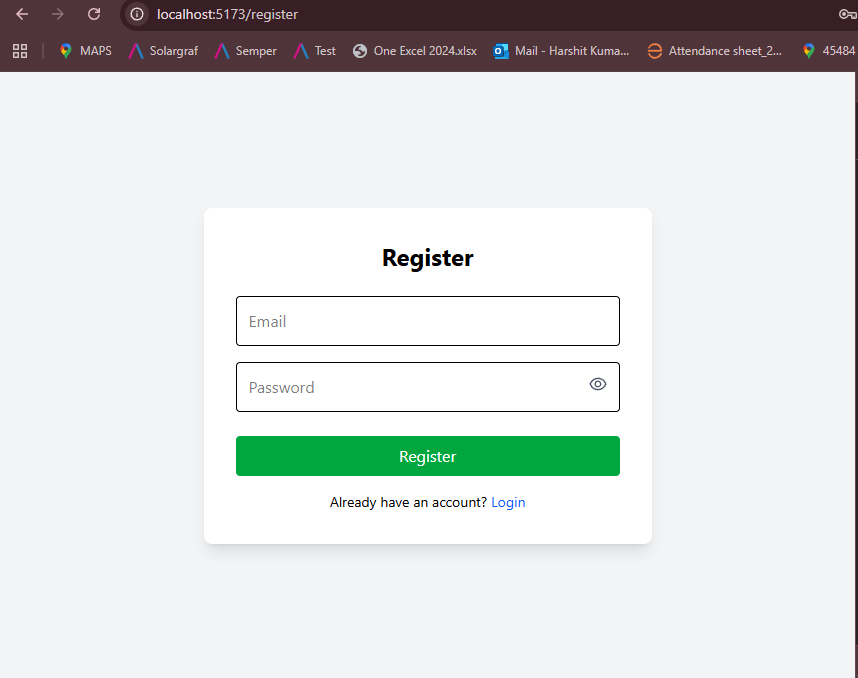
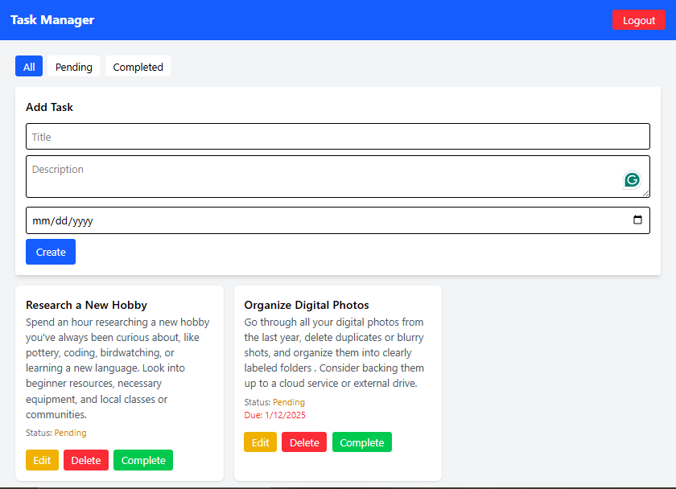

## 🌐 Live Demo

[Vercel Live Demo](https://task-manager-app-six-beryl.vercel.app)

### Backend Render Link

[Backend Render Link](https://task-manager-app-z6qy.onrender.com/)

---

## 📦 GitHub Repository

[GitHub Repo](https://github.com/sharmaHarshit2000/task-manager-app)

---

# 📝 Task Management App

A simple **full-stack Task Management application** built with **MERN Stack** (MongoDB, Express, React, Node.js) + **Tailwind CSS** + **React Hot Toast**.  
It allows users to register, log in, create tasks, update them, mark as complete, and delete them.

---

## 🚀 Features

- 🔐 **JWT Authentication** (Register & Login)
- ➕ Create tasks
- ✏️ Edit tasks
- ✅ Mark tasks as complete
- 🗑️ Delete tasks
- 🔍 Filter tasks by **All**, **Pending**, and **Completed**
- 🎨 Styled with **Tailwind CSS**
- ⚡ Uses **Axios** for API calls
- 🔔 Toast notifications using **React Hot Toast**

---

## 📸 Screenshots

| Login Page | Register Page | Task List |
|------------|---------------|-----------|
|  |  |  |

---

## 🛠 Tech Stack

### **Frontend**
- React
- React Router
- Axios
- Tailwind CSS
- React Hot Toast

### **Backend**
- Node.js
- Express.js
- MongoDB + Mongoose
- JWT Authentication
- Bcrypt Password Hashing

---

## 📂 Project Structure

```
task-manager-app/
  ├── backend/
  │   ├── models/
  │   ├── routes/
  │   └── controllers/
  ├── frontend/
  │   ├── components/
  │   ├── pages/
  │   └── services/
```

---

## ⚙️ Setup Instructions

### 1️⃣ Backend Setup

```bash
cd backend
npm install
```

Create `.env` file in `backend/`:

```ini
PORT=5000
MONGO_URI=mongodb://127.0.0.1:27017/taskapp
JWT_SECRET=your_jwt_secret
```

Run backend:

```bash
npm run dev
```

---

### 2️⃣ Frontend Setup

```bash
cd frontend
npm install
```

Create `.env` file in `frontend/`:

```bash
VITE_API_BASE=http://localhost:5000/api
```

Run frontend:

```bash
npm run dev
```

---

## 📌 API Endpoints

### Auth

- `POST /api/auth/register` – Register user
- `POST /api/auth/login` – Login user

### Tasks

- `GET /api/tasks` – Get all tasks (optional status query)
- `POST /api/tasks` – Create task
- `PUT /api/tasks/:id` – Update task
- `PATCH /api/tasks/:id/complete` – Mark task as complete
- `DELETE /api/tasks/:id` – Delete task

---

## 💡 Approach

- Backend handles data persistence, authentication, and business logic.
- Frontend is a React SPA that communicates via Axios with the backend API.
- Used Tailwind CSS for rapid styling.
- Implemented filtering logic to switch between task statuses.
- Added toast notifications for better UX.

---

## 🧩 Challenges Faced

- Managing auth token persistence between sessions.
- Handling filter state along with API calls.
- Keeping UI responsive while waiting for API requests.
- Ensuring CORS works for local frontend-backend communication.

---